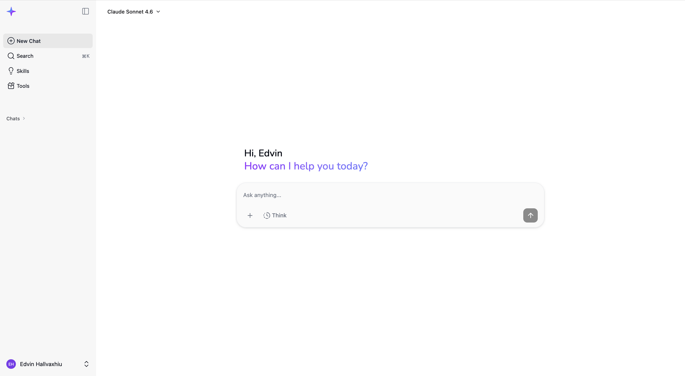

# AI assistant on Bedrock AgentCore

Sparky is a full-stack AI assistant deployed entirely on [Amazon Bedrock AgentCore Runtime](https://docs.aws.amazon.com/bedrock/latest/userguide/agentcore.html). It pairs a React frontend (hosted on AWS Amplify) with a Python backend running as containerized AgentCore runtimes, giving you a private, self-hosted AI Assistant inside your own AWS account.

<picture>
  <source media="(prefers-color-scheme: dark)" srcset="./assets/chat_dark.png">
  
</picture>

**Note:** This is a sample implementation provided for educational and demonstration purposes. You should review, test, and customize this code for your specific requirements before deploying to any environment.

## What you get

**Models & reasoning** — Switch between Claude Opus 4.6, Sonnet 4.6, Opus 4.5, and Haiku 4.5 (or add your own). Each model supports configurable reasoning levels from quick answers to deep thinking.

**Code execution** — Run Python in a sandboxed AgentCore Code Interpreter. Matplotlib charts are captured automatically, DataFrames render as interactive tables, and generated files (PPTX, CSV, etc.) get download links.

**Research mode** — A dedicated agent that can chain together web search, code execution, MCP servers, and any other available tool to work through multi-step investigations.

**Canvas** — A side panel for creating and editing content alongside the chat. Six types: markdown documents with LaTeX and syntax highlighting, live-rendered HTML/CSS/JS, a code editor, draw.io diagrams with cloud architecture icons, Mermaid diagrams with SVG export, and raw SVG graphics.

**Browser** — Browse the web in a sandboxed AgentCore session with a live stream rendered directly in the chat.

**Projects** — A workspace for organizing files and context around a specific goal. Attach files to a project and the agent can search across them using a dedicated Bedrock Knowledge Base. Projects persist across conversations and can be associated with multiple chats.

**Skills** — Reusable prompt-based instructions (with optional Python scripts, templates, and reference documents) that teach the agent specific workflows. Create your own or use the built-in ones.

**MCP servers** — Extend the agent with any [Model Context Protocol](https://modelcontextprotocol.io/) server, either remote (`streamable_http`) or local (`stdio`).

**The rest** — Streaming responses, image understanding (up to 20 per conversation), conversation branching, persistent chat history, semantic search across past conversations, per-user tool configuration, and Cognito authentication.

## Prerequisites

- AWS CLI configured with appropriate credentials
- Terraform &gt;= 1.5
- Docker with buildx support (for ARM64 image builds)
- Node.js &gt;= 18 and npm
- Python 3.12
- `jq` (used by the frontend deployment script)
- If using OpenSearch Serverless as vector store: `pip install opensearch-py requests-aws4auth`

## Deployment

An interactive wizard handles the full setup:

```bash
chmod +x deployment.sh
./deployment.sh
```

It will ask for a deployment type (backend, frontend, or both), AWS region, and user details for Cognito. Then it runs Terraform, builds and pushes Docker images to ECR, generates the frontend `.env`, and deploys to Amplify.

On subsequent runs it detects the existing `.deployment.config` and offers to reuse your previous settings.

## Teardown

```bash
chmod +x destroy.sh
./destroy.sh
```

Reads your `.deployment.config`, confirms the action, runs `terraform destroy`, and cleans up local config files.

## Configuration

### Models

All model configuration lives in a single Terraform variable (`sparky_models` in `infra/variables.tf`) that flows to both backend and frontend.

To add a model, append an entry:

```hcl
{
  id             = "claude-sonnet-4"
  model_id       = "anthropic.claude-sonnet-4-20250514-v1:0"
  label          = "Claude Sonnet 4"
  description    = "Balanced"
  max_tokens     = 64000
  reasoning_type = "budget"
  budget_mapping = { "1" = 16000, "2" = 30000, "3" = 42000 }
  effort_mapping = {}
  beta_flags     = ["interleaved-thinking-2025-05-14"]
}
```

To remove a model, delete its entry. Make sure `default_model_id` still points to a valid ID. Redeploy the backend after changes.

### Other variables

| Variable                      | Default              | Description                                            |
| ----------------------------- | -------------------- | ------------------------------------------------------ |
| `region`                      | `us-east-1`          | AWS deployment region                                  |
| `env`                         | `dev`                | Environment name (used in resource naming)             |
| `enable_core_services`        | `true`               | Enable/disable the Core Services runtime               |
| `expiry_duration_days`        | `365`                | Data retention period (30–365 days)                    |
| `model_core_services`         | `claude-haiku-4.5`   | Model for background tasks like description generation |
| `deletion_protection_enabled` | `false`              | DynamoDB deletion protection                           |
| `rerank_model_arn`            | `amazon.rerank-v1:0` | Rerank model for search result ordering                |
| `kb_vector_store_type`        | `S3_VECTORS`         | Vector store: `S3_VECTORS` or `OPENSEARCH_SERVERLESS`  |
| `enable_projects`             | `true`               | Enable/disable the Projects feature and its resources  |

### Conversation search

Past conversations are indexed into a Bedrock Knowledge Base for semantic search. The default vector store is Amazon S3 Vectors — no extra infrastructure, negligible cost. Switch to OpenSearch Serverless (`kb_vector_store_type = "OPENSEARCH_SERVERLESS"`) if you need hybrid semantic + keyword search, but note it carries continuous OCU-hour charges.

## Built-in tools

| Tool                     | Description                                                                             |
| ------------------------ | --------------------------------------------------------------------------------------- |
| Code Interpreter         | Sandboxed Python execution with chart capture, DataFrame rendering, and file generation |
| Tavily Web Search        | Web search and content extraction (requires API key, configurable in the UI)            |
| Browser                  | Sandboxed web browsing with live session streaming                                      |
| Skill Management         | Fetch and manage reusable prompt-based skills                                           |
| Review Progress          | Self-reflection for Research mode investigations                                        |
| Image Retrieval          | Fetch and display images from S3 artifacts                                              |
| Download Link Generation | Generate presigned S3 URLs for file downloads                                           |

## MCP servers

Add MCP servers from the Tool Configuration page in the UI.

**Remote servers** (`streamable_http`) — provide a name and the server URL.

**Local servers** (`stdio`) — provide a name, a Python command (e.g., `uvx`), and arguments. Only Python-based commands are supported since the backend runs in a Python container. For servers with complex or non-Python dependencies, use a remote server instead.

## Skills

Skills are reusable instructions that teach the agent specific workflows. They live in the Skills page and can include optional Python scripts, PowerPoint templates, and reference documents that get loaded into Code Interpreter when invoked.

**User skills** are created from the UI — give them a name, description, instruction prompt, and optionally attach scripts, templates, or references. Toggle visibility between private and public.

**System skills** ship with the solution and are available to all users. To add one, create a directory under `system-skills/`:

```
system-skills/
└── my-new-skill/
    ├── SKILL.md            # Frontmatter (name, description) + instruction prompt
    ├── scripts/            # Optional Python scripts
    └── references/         # Optional reference documents (.md), loaded on demand
```

`SKILL.md` uses YAML frontmatter for metadata, followed by the instruction prompt:

```markdown
---
name: my-new-skill
description: What this skill does and when to use it. Written in third person.
---

Instruction prompt for the agent goes here.
```

**References** are supplementary markdown files that extend the skill's instructions without bloating `SKILL.md`. They are uploaded to Code Interpreter alongside scripts when the skill is fetched, but disclosed to the agent only on demand — useful for detailed guides (e.g., chart design rules for a PPT skill) that are not always needed.

Redeploy the backend and Terraform syncs it to S3 and DynamoDB automatically.

## Project structure

```
├── backend/
│   ├── sparky/              # Main agent runtime (LangGraph)
│   │   ├── project_service.py       # Project CRUD and chat associations
│   │   ├── project_file_manager.py  # S3 file operations for projects
│   │   └── project_kb_service.py    # Bedrock KB ingestion and retrieval
│   ├── core_services/       # Synchronous API runtime (history, tools, skills, search)
│   ├── kb_indexer/          # Lambda: indexes conversations into Knowledge Base
│   └── expiry_cleanup/      # Lambda: cleans up expired KB docs and memory events
├── src/                     # React frontend (Vite + Tailwind)
├── infra/                   # Terraform infrastructure
│   └── projects.tf          # DynamoDB tables, S3 bucket, and Bedrock KB for projects
├── system-skills/           # Built-in skills deployed to S3
├── deployment.sh            # Interactive deployment wizard
└── destroy.sh               # Teardown script
```

## License

See [LICENSE](LICENSE).

## Authors

The following authors have contributed this sample within AWS and prepared it for open-source release:

- [Edvin Hallvaxhiu](https://github.com/edvinhallvaxhiu)
- [Khoa Nguyen](https://github.com/khoanguyenaws)
- [Aubrey Oosthuizen](https://github.com/a13zen)

Special thanks to [Bruno Dhefto](https://github.com/dhefto) for his thorough review and suggestions that helped improve the solution.
